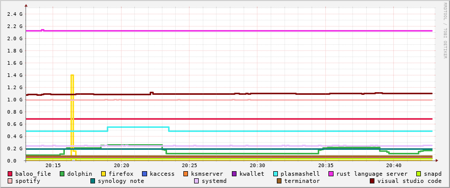
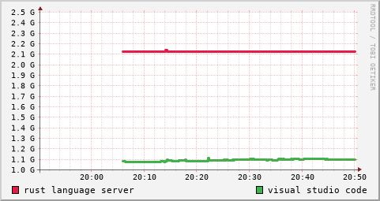
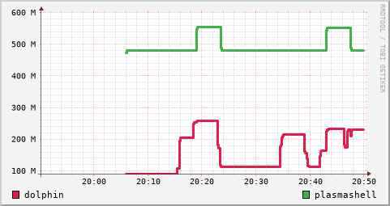
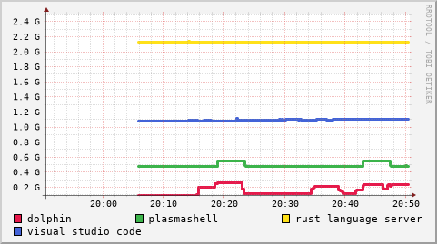
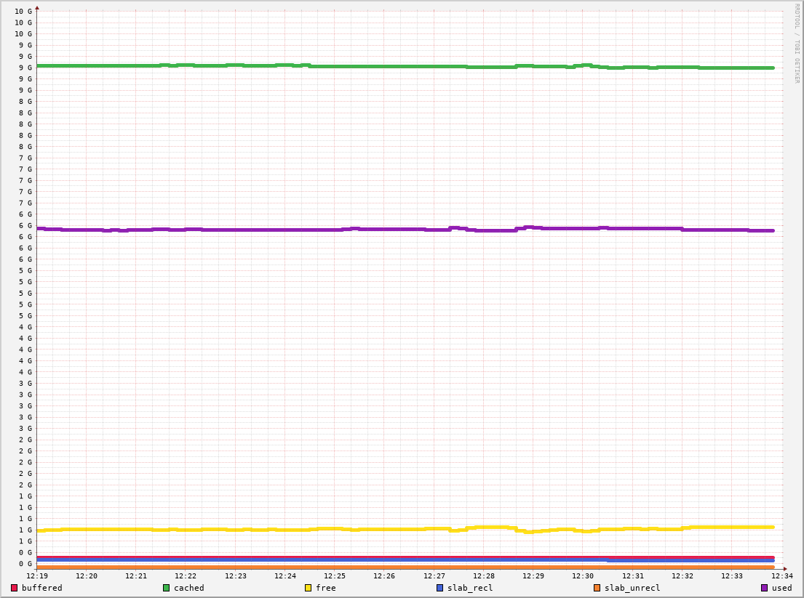
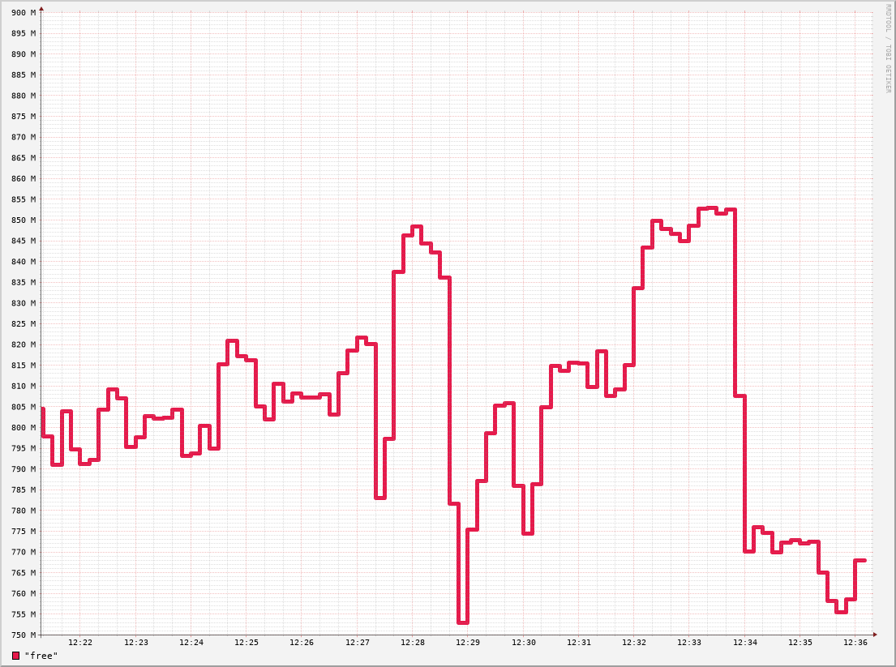

# collectd-graph-generator

[](https://www.gnu.org/licenses/gpl-3.0)
[](https://travis-ci.org/twardakm/collectd-graph-generator)
[](https://codecov.io/gh/twardakm/collectd-graph-generator)

##### Table of Contents

* [Overview](#overview)
* [Requirements](#requirements)
  * [Remote collectd](#remote-collectd)
* [Supported collectd plugins](#supported-collectd-plugins)
* [Examples](#examples)
  * [All supervised processes from local system](#examples-1)
  * [4 specific processes from remote system on 2 separate graphs](#examples-2)
  * [4 specific processes from remote system on 1 graph](#examples-3)
  * [System wide memory](#examples-4)

## <a name="overview"></a> Overview

Goal of this project is to create as simple as possible tool for viewing data generated by collectd - especially RSS memory used by multiple processes. There is a [list of front ends for collectd](https://collectd.org/wiki/index.php/List_of_front-ends) but I was unable to find one fitting all my purposes:

* Presenting RSS memory of multiple processes at one chart
* Presenting data from a server via SSH
* No knowledge of Rrdtool

It's not a very impressive list but I ended up writing long Rrdtool commands, which **I don't want to do every day**.

## <a name="requirements"></a> Requirements

It's written and tested only on different Linux distros (Manjaro, Ubuntu, maybe some other in the future), and it requires system commands:

* `ssh`
* `scp`
* `rrdtool`

### <a name="remote-collectd"></a> Remote collectd

Main motivation for creating this tool was to gather some information from my home server without constantly logging in and executing some commands. **cgg** is able generate all the graphs on both, local and remote, systems. To make it work you need to set up your SSH keys to enable logging without password and to **have rrdtool installed on remote system**. This requirement is due to different headers of rrd files for different architectures. I didn't find an easy way to utilize x86 or amd64 rrdtool for ARM data.

## <a name="supported-collectd-plugins"></a> Supported collectd plugins

* [processes](https://collectd.org/wiki/index.php/Plugin:Processes) - draws graph of RSS memory usage of all, or chosen, processes supervised by collectd. It's possible to define maximum number of processes presented on one graph and if number of processes to draw is greater, multiple files are created.
* [memory](https://collectd.org/wiki/index.php/Plugin:Memory) - draws graph of system wide memory usage. By default it draws free memory, but other types of memory can be specified in `--memory` arg:
  * buffered
  * cached
  * free
  * slab_recl
  * slab_unrecl
  * used

## <a name="examples"></a> Examples

### <a name="examples-1"></a> All supervised processes from local system
```bash
./cgg -i /var/lib/collectd/marcin-manjaro/ -t "last 30 minutes" -o "30_minutes_all_processes.png"
```
<p align="center"> 

</p>

### <a name="examples-2"></a> 4 specific processes from remote system on 2 separate graphs
```bash
./cgg -i marcin@localhost:/var/lib/collectd/marcin-manjaro/ -t "last 1 hour" -o "1_hour.png" -w 400 -h 200 --processes "rust language server,visual studio code,dolphin,plasmashell" -m 2
```

Rust language server and Visual studio code | Dolphin and Plasmashell
:------------------------------------------:|:------------------------------------------:
  |  

### <a name="examples-3"></a> 4 specific processes from remote system on 1 graph
```bash
./cgg -i marcin@localhost:/var/lib/collectd/marcin-manjaro/ -t "last 1 hour" -o "1_hour.png" -w 400 -h 200 --processes "rust language server,visual studio code,dolphin,plasmashell"
```
<p align="center"> 

</p>

### <a name="examples-4"></a> System wide memory
<table>
<tr>
<td><b>All memory types</b></td>
<td><b>Default settings (free)</b></td>
</tr>
<tr>
<td>

```bash
./cgg \
-i marcin@localhost:/var/lib/collectd/marcin-manjaro/ \
-p memory \
-t "last 15 minutes" \
-o "system wide memory.png" \
--memory buffered,cached,free,slab_recl,slab_unrecl,used
```
</td>
<td>

```bash
./cgg \
-i /var/lib/collectd/marcin-manjaro/ \
-p memory \
-t "last 15 minutes" \
-o "free memory.png"
```
</td>
</tr>
<tr>
<td>
<p align="center">

</p>
</td>
<td>
<p align="center">

</p>
</td>
</tr>
</table>